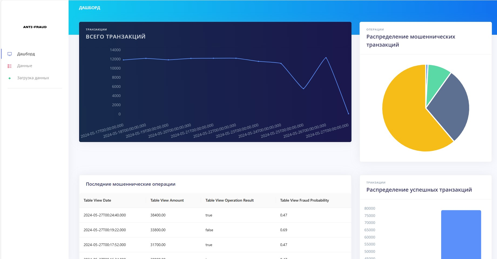

## Описание
Этот проект представляет собой систему для обнаружения мошенических транзакций в финансовых данных. Мы используем следующие технологии

- FastAPI: Быстрый фреймворк для создания API на Python.
- React: Фронтенд-библиотека для построения интерактивных пользовательских интерфейсов.
- Cube.js: Открытая платформа для анализа данных.
- PostgreSQL: База Данных

## Запуск проекта

1. Убедитесь, что у вас установлен Node.js, Python и npm (Node Package Manager).
2. Склонируйте этот репозиторий на свой компьютер.
3. Перейдите в папку проекта:

    ```bash
    cd client/dashboard/
    ```

4. Установите зависимости:

    ```bash
    npm install
    ```

5. Запустите проект:

    ```bash
    npm run build
    ```
6. Откройте index.html в папке build

## Запуск API

1. Перейдите в папку проекта:

    ```bash
    cd server
    ```

2. Установите зависимости

    ```bash
    pip install -r .\requirements.txt
    ```
3. Запустите файл main.py

## Внешний вид сервиса



Инференс
[ТЫК](https://fraud-lime.vercel.app/#/admin/index)
